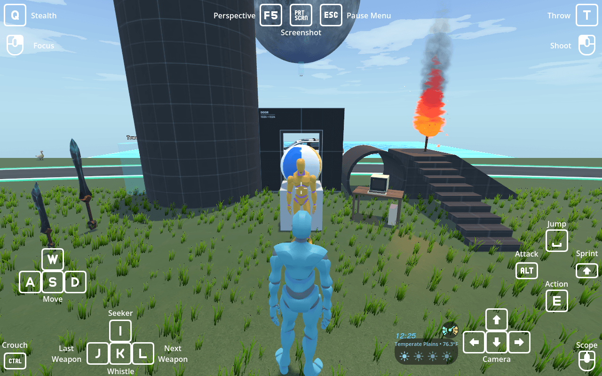

# godot-3d-player-controller-v3

The QA world for the addons developed at [github.com/kirbycope](https://github.com/kirbycope): a
GodotSteam multiplayer sandbox that installs every addon at once and puts something in the level to
exercise each of them.

Click [here](https://timothycope.com/godot-3d-player-controller-v3/) to play!

---

## Addons

Each addon is developed in its own repository and fetched into `addons/` here (see
[Running and testing](#running-and-testing)), and **its README is where its
features are documented**. This file covers only what belongs to the game project.

| Addon | Repository | What it provides |
| --- | --- | --- |
| `addons/3d_player_controller` | [godot-3d-player-controller-addon](https://github.com/kirbycope/godot-3d-player-controller-addon) | The Player: locomotion state machine, camera, equipment and combat, projectiles, inventory and spell system, abilities, chat, throwing, toon shading, health, stamina, settings, Zelda and GTA control schemes, checkpoints and the death flow, the save game, the NPCs (`FollowerNpc`, `EnemyNpc`, `NpcCaster`, `TalkingNpc`), dialogue and quests, local split screen, Steam lobby UI and the multiplayer spawners |
| `addons/controls` | [godot-controls](https://github.com/kirbycope/godot-controls) | On-screen input hints and the world-space `ActionPrompt` |
| `addons/weather_fx` | [weather-fx](https://github.com/kirbycope/weather-fx) | Biomes, precipitation, wind, wildfire, lightning, the sky and cloud driver, water shader and ripples |
| `addons/date_and_time` | [date-and-time](https://github.com/kirbycope/date-and-time) | The in-game clock and calendar HUD |
| `addons/gta` | [gta](https://github.com/kirbycope/gta) | Drivable vehicles with GTA V style handling |
| `addons/tcps` | [tcps](https://github.com/kirbycope/tcps) | The skateboard |
| `addons/radi_ot` | [radi-ot](https://github.com/kirbycope/radi-ot) | Internet radio, played through the car |
| `addons/godot_doom_gdextension` | [godot-doom-gdextension](https://github.com/kirbycope/godot-doom-gdextension) | PureDOOM as a GDExtension, plus a fallback raycaster |
| `addons/dialogic` | [dialogic](https://github.com/dialogic-godot/dialogic) (third party, 2.0 alpha 20) | The dialogue system: timelines, characters, the text box, choices and conditions |

The third-party addons (`dialogic`, `gut`, `midi`, `godotsteam`, `GPUTrail`) are other people's work.
They are fetched by the same script, pinned to a release, and never pushed to. See
[Pulled addons in CREDITS.md](CREDITS.md#pulled-addons) for each one's author, licence and upstream.

---

The game has two starts on purpose. On the desktop, and when run from the editor, `scenes/main.tscn` opens on
the title screen. Its main menu is Single-Player, Multi-Player, Options and Quit Game; Single-Player opens a
second panel offering **New Game**, **Continue** while a save exists at the `SaveGame` default path
(`SaveGame.DEFAULT_SAVE_PATH`, `user://savegame.json`), and Back.
Continue is not on the main menu, so the top level says what kind of game you want before it asks which one.
Back, and the Cancel action (B on a controller, Escape), return to the main menu. New Game emits
`new_game_pressed` and Continue emits `continue_pressed`; `scenes/main.tscn` wires the first to `Main.new_game`,
which puts the saved controls back to their defaults (the world's own layout, on-screen controls on Auto) before
loading the world, and the second to `Main.continue_game`, which keeps them and sets `SaveGame.load_requested`
before loading the same world. Options opens the player controller's own settings menu, instanced hidden in
`scenes/title_screen.tscn` with its Audio, Controls and Video pages beside it and wired to one another in that
scene; its Back returns to the title with Options focused. Every title button also answers a touch, through the
`TouchScreenButton` on it. A controller's A presses the focused title button only while the title is showing, so
it never reaches behind the lobby explorer or the settings. The settings pages keep their own input on the title
too: they close on Start only where a Player has registered it.

The world goes back to the title when its Steam session ends: Leave in the lobby menu, the host going away, or a
join that fails all end at the addon's `SteamPeer.session_ended`, which `world.tscn` wires to
`world.gd`'s `_on_session_ended`, and that loads `title_scene` (`scenes/main.tscn`).
The web export opens on the Click to Start
overlay, since a browser lets the game capture the mouse and play audio only from inside a user gesture, and
the click or touch goes straight into the single-player world; there is no Steam on the web and no title screen.

The Web preset in `export_presets.cfg` exports selected resources and their dependencies
(`export_filter="resources"`), so the build carries only what the game uses. Scenes and resources reach the
build through `export_files`. That list also names everything a script loads by path at run time rather than
through a scene: the item, control scheme and toon `.tres` files, the deflated beach ball, the quest screen,
Dialogic's default layout, GPUTrail's defaults and `default_bus_layout.tres`. A `preload` in a script is not
followed by the export, so a new one needs its target added there too. `include_filter` adds only scripts,
shaders, the GDExtensions, the DOOM `.wad`, the MIDI soundfont, and the keyboard glyph folder that
`PlayerControls` picks icons from by name. After exporting, `python tools/pck_missing.py build/index.pck` lists
anything a packed script or scene names that the pack lacks, and `python tools/web_smoke_test.py` loads the
build in headless Chromium.

## What is in the world

`scenes/world.tscn` is the level. The parts below are this project's own, under `scenes/` and
`resources/`:

- **Fishing** (`FishingRod`, `Bobber`, `FishShadows`, `FishingLog`): cast where you aim, watch the
  float dip, hook inside the window and the catch arcs into your hands and onto the Food tab of the
  inventory. Each water's `Buoyancy` holds its fish table (`resources/fish/`, keyed by hour, rain,
  lure and biome); lures (`resources/lures/`) are consumable items that go on the line. The catch
  screen holds the fish up Zelda style (the fish keeps turning on its own clock while the world behind it is frozen), the pause menu's Fish Index lists every species with its
  record. Every peer sees and hears the whole bite: the float goes through the `ProjectileSpawner`, the rod's
  sounds play at the float with its splashes, the reel spins on every copy of the rod, and the shadows' moves at the
  float (drawn in, nibbling, diving, scattering) are `FishShadows` RPCs, so each peer plays them on its own
  shadows. Each shadow is an instance of `scenes/fish_shadow.tscn`: its `ScareArea` (the swimmer's scare, on no
  collision layer, so neither the crosshair, a round nor a cast stops on it) and a `ShootArea` the size of the
  shadow on the projectile layer, off while the shadow is hidden. Shooting a fish sinks it on every peer and puts
  chum in the shooter's own bag, never in another peer's copy of them. A catch the bag has no room for still sets
  the species' record but adds no length to the log.
- **Enemies** (`enemy_swordsman.tscn`, `enemy_archer.tscn`, `enemy_rifleman.tscn`,
  `enemy_spellcaster.tscn`): a swordsman, an archer, a rifleman and a spellcaster east of the spawn.
  They hunt over the navmesh, attack in reach, take headshots, and leash back to their post like a
  WoW mob. The scripts (`EnemyNpc`, `NpcCaster`, `FollowerNpc`) and the base scene are the addon's
  now; this project's `scenes/npc/enemy_npc.tscn` inherits it and hangs the weather addon's flame under
  `BurnVFX`, and the four enemies inherit that, each with its N-Hance weapon.
- **The ability library**: `AbilityLibrary` in `world.tscn` is the addon's `scenes/ability_library.tscn` made editable, with the game's eleven spells (`resources/abilities/`) added as `AbilityEntry` children beside the addon's Heal and Stealth. It warms every spell's VFX at start, and the Player's `Abilities` and every `NpcCaster` take their abilities from it, so the enemy spellcaster and the Player share one loaded copy of each.
- **The Guide** (`TalkingNpc` with a `Conversation` under it, `scenes/conversation.gd`,
  `resources/dialogues/qa_guide.dtl` and `guide.dch`, `resources/quests/qa_errand.tres`): stands by the
  spawn with an errand: talk to him, fell a tree with an axe and land a fish, and he pays three apples. The
  addon's NPC only offers Talk, holds the Player still and emits `talked_to`; the conversation itself is
  [Dialogic](https://github.com/dialogic-godot/dialogic), this project's. `Conversation` publishes the quest
  log to Dialogic as `{quest.<id>}` (`not_started`, `active`, `complete`) and `{objective.<id>}`, so the
  timeline branches on them, and the timeline drives the log back through Dialogic's signal event:
  `[signal arg="start_quest qa_errand"]`, `[signal arg="progress talk_guide"]`. The Action button advances
  the text and reads Next; while a question is up it reads Pick and picks the focused choice (Dialogic focuses the first, the d-pad or stick moves it); Start ends the conversation. Any of the three choppable trees under `Quaternius` in `world.tscn` (`Tree01`
  to `Tree03`, each its own `tree_01.tscn` instance) is the firewood: each one's `depleted` is connected to
  `world.gd` in the scene, and the server, which counts the felling strike as the striker's peer sends it
  (`Gatherable._strike`), credits the chop only to the peer whose Player landed it. `FishingLog.record_catch` reports the fish. The tracker sits top right and the Quests page is in the
  pause menu.
- **Checkpoint, kill zone and saving**: the beacon west of the spawn is the addon's `Checkpoint`; the
  `KillZone` fifty metres down is lethal, so falling off the map is a death, the death screen and a
  respawn at the checkpoint. The `SaveGame` node writes `user://savegame.json` from the pause menu's
  Save Game (and on every checkpoint), keeping the Player, the world's clock and weather (`world.gd` is
  in the `Saveable` group), every tree's and ore's strikes and the enemies; Load Game reads it back, and
  the title screen's Single-Player panel shows Continue while the file exists. The Player is spawned, so
  `world.tscn` connects `PlayerSpawner.local_player_spawned` to `SaveGame.load_for_player`: Continue loads the file
  once this peer's Player is in, although the spawner, earlier in the tree, spawns it before the SaveGame is
  ready.
- **Companions** (`FollowerNpc`): a duck that respawns as a giant boss (its size, animation and
  health replicate, so every peer sees the giant walk and eat; its quacks are the server's and play on every peer,
  and the giant bites on its `AttackQuackCooldown`; a client's swing reaches the server's duck naming the swinging
  Player, and the server takes it only from that Player's peer; the boss bar follows its `Health` through a
  connection in `duck.tscn`) and a "little buddy" that can be
  picked up and thrown: the carrier's peer owns it while it is in their hands, every peer sees it on
  their arm, and its walk blend replicates. The server hands it out: a pick-up counts only once the server has put
  it on that Player's arm, so of two Players reaching for it one gets it, and a carrier or thrower who leaves the
  game leaves it back in the scene, the server's again.
- **Horse** (`Horse`): a rideable on the player controller's `Riding` contract, with a whistle that
  summons the nearest one over the navmesh. The whistle is heard as well as answered: `WhistleAudio` on
  the world's Player template takes an `AudioStreamRandomizer` of the three AudioHero human whistles, so the same
  player never whistles identically twice, and `world.gd` plays it on `Player.whistled` before
  `Horse.summon_nearest` picks the horse. It swims, replicates, and hands its authority to the
  rider; a horse somebody else is riding refuses the prompt and the mount, and the server arbitrates the saddle, so
  of two Players getting on at once the second is put back off with their own layout. Getting on puts up Breath
  of the Wild's horse layout (`resources/control_schemes/totk_horse.tres`, the horse's
  `riding_control_scheme`): A gallops, B gets off, X jumps and the rest of the pad is cleared, with
  the rider's own layout back on getting off, the way the skateboard swaps to Tony Hawk's. On the
  keyboard Shift gallops and E gets off, and the HUD draws those keys on the buttons that do them.
- **Project spells** (`scenes/*_ability.gd`, `resources/abilities/`): the WoW-style set built on the
  addon's `Ability` resource - Firebolt, Fireball, Frostbolt, Lightning Bolt, Lightning, Chain
  Lightning, Flash of Light, Consecration, Shadowstep, Sword Slash and Freeze - arranged on the QA
  spell tree (`resources/spells/qa_tree.tres`). Lightning and Chain Lightning borrow the weather's bolt
  (`LightningFX`) and bring it down through the world's `ProjectileSpawner`
  (`strike_lightning`, `arc_lightning`), so a client's bolt is the server's to strike and shows on every peer; a
  chain's jumps, and each tick of Consecration's `DamageZone`, hit through `Ability.affect`, which names the caster,
  so the server takes a client's hit on an enemy or the duck as that client's.
- **Elemental ammunition** (`fire_arrow.tscn`, `ice_arrow.tscn`, `incendiary_round.tscn`,
  `ice_block.tscn`): fire lights grass and sets enemies ablaze, ice freezes a walkable slab into the
  pond.
- **Retro computer** (`RetroComputer`): a beige desktop whose CRT runs DOOM through the GDExtension,
  behind a curved-glass shader (`scenes/crt_screen.gdshader`). One Player at a time: a chair another
  peer's Player is already in is refused. Hands on the keyboard hold nothing: sitting down stows what was equipped and standing up puts it back in hand. Select/View still swaps perspective at the keyboard: the seat's view moves between the over-the-shoulder shot and square on to the screen, and the Player's own camera changes with it, so they stand up in the perspective they chose.
- **Water and props**: the pool with `Buoyancy` on its area, floating the beach ball (a bump on what
  it rolls into, never a weapon hit and never a chop; shoot it and it deflates, see below) and rocking the boat on the weather addon's
  Gerstner waves; a bowling alley, balloons to shoot (the ring spins on every peer), choppable trees
  and mineable ore, a push button, warp zones, a wooden sign and a moon with its own
  gravity. The boat, the trees, the ore and the sign answer a client's Action too. The boat's seat is the server's to
  give (`occupant_peer`, replicated by its `SeatSynchronizer` through `resources/boat_replication.tres`): the first
  Player to ask sits, a second is refused, every peer hides the dummy passenger while somebody real sits there, and
  standing up or leaving the game frees it. The rod, the horse, the boat and the buddy all ignore Action while the
  chat field is being typed in or a menu is open. A popped balloon hides
  rather than frees, and its `is_popped` replicates (`scenes/red_ballon_replication.tres`), so a peer joining
  later finds it gone; its plush falls on the server, which alone unfreezes it, and reaches everyone else through
  the plush's `BodySynchronizer`. A felled tree's log is simulated the same way, by the server, with a
  `BodySynchronizer` on `tree_01.tscn`'s `RigidBody3D`. A round's hit on the ball, a balloon, a fish or the duck
  is counted by the server's copy of the round alone, a client's shot included, and the server sends the burst,
  the pop, the sinking fish or the quack to every peer. The push button goes down on every peer: the pusher's
  peer sends the press, and a peer whose Player is not at the button is ignored. The sign reads for the local
  Player only, so another peer's Player walking up or away neither takes it over nor closes it.
- **Shooting the beach ball deflates it** (`scenes/beach_ball.gd`, `scenes/beach_ball_deflated.tscn`): a round
  or an arrow arrives through `register_projectile_hit`, and the ball hands over to a `SoftBody3D` twin wearing
  the same shader. Squashing the rigid ball's own mesh was the first attempt and only ever looked like a
  squashed sphere, because the collider stays a sphere underneath; the twin is real cloth, so it creases and
  folds the way plastic does. The twin's `pressure_coefficient` falls to nothing over `deflate_seconds`, which
  is the air going out; Jolt implements that as `SoftBodySharedSettings::mPressure`, so it is honoured here.

  Getting the whole deflation to read took three levers rather than one, and the order they were found in is
  worth keeping. **Pressure** gives the sag: the shell holds round at 45 and caves in as it empties, but much
  above that the pressure propels the twin, and 150 threw it five metres. **Stiffness** tweens down with it, so
  the plastic softens as it empties. Neither flattens it: emptied and softened the shell still settles as a
  bowl, because once its vertices are at rest nothing is left pushing them down, and loosening
  `simulation_precision` at that point does nothing either. **Weight** is what finishes it, so `_go_limp` raises
  `total_mass` to `deflated_mass` and the shell folds into a flat ring.

  One bug hid all of that for a while: the twin used to be built before the rigid ball's collider was disabled,
  and a soft body born inside a live sphere collider is shoved out of it and creased flat within a frame or
  two. That is why the deflation looked instant however it was tuned. The collider now goes first, immediately
  rather than deferred.

  Three things about `SoftBody3D` are worth knowing before changing any of this, because each one cost a
  rewrite. It cannot sit in the scene waiting its turn: this project runs Jolt (`3d/physics_engine`), which
  reports "Doing so without a physics space is not supported when using Jolt Physics" for any transform set on
  a soft body outside the space, and a disabled node is outside it, so a dormant twin logs that on every touch. It cannot be positioned either, at any point in its life, out of
  the space because Jolt refuses and in it because the physics server owns its vertices; the twin is therefore
  instantiated at the moment of the hit and added as a **child of the ball**, which is what places it, since
  entering the tree is when a soft body is built and it is built wherever it finds itself. And its deformation
  is invisible to `get_aabb()`, which keeps reporting the undeformed mesh, so the only honest check on how it
  looks is to look at it.

  It deflates on every peer the way a balloon pops, server-authoritative, and `is_deflated` replicates
  (`scenes/beach_ball_replication.tres`) so a peer joining later gets a ball that is already empty with no
  deflation to watch. Each ball copies the scene's shared `ShaderMaterial` on ready, so deflating one cannot
  reach the others. `deflate_sound` takes an `AudioStreamRandomizer` of the three AudioHero air-release clips, so the same ball does not hiss identically twice. They run 4.3s, 5.4s and 9.3s against a deflation of about a second and a half, so `_go_limp` stops the player when the pressure reaches nothing: the hiss ends with the air rather than carrying on over a flat ball.
- **The world's controls**: `world.gd` puts its own `control_scheme` on the Player as it spawns and turns the
  whole on-screen HUD on only when asked (`show_controls`, off by default, so the saved On-Screen setting decides: Auto shows the buttons on a touchscreen and otherwise only as contextual hints), so the world is played on Tears of the Kingdom's pad with every
  button readable: A dashes, B is Action, X attacks, Y jumps, the triggers are Focus and Shoot. The Player
  applies the saved settings in its own `_ready`, which runs first, so the world's choice is the one that
  sticks; clear either export to leave the Player on whatever its scene or the settings menu chose.
- **The noise meter** (`NoiseMeter`, mounted in `world.tscn` under `HUD/BottomRight`): the Breath of the
  Wild style readout of how much noise the Player is making, a flat line when they are quiet and a waveform
  that grows with the racket. Both it and the `PlayerNoise` that feeds it belong to the player controller
  addon, which documents how the reading is built and what hears it; what this project supplies is the corner
  of the HUD it sits in, beside the enemies that come looking when it runs loud, and the wiring: `world.tscn`
  connects `PlayerSpawner.local_player_spawned` to the meter's `follow`, so it reads the Player this peer
  controls, never another peer's copy.
- **Trees and ore** (`Choppable`, `Mineable`, `scenes/harvestable.gd`): each scene (`tree_01.tscn`,
  `tree_02.tscn`, `ore_small.tscn`, `ore_large.tscn`) inherits the player controller's
  `scenes/prop/gatherable.tscn`, so the addon's `Gatherable` does the counting: a strike from the right tool
  (`needs`: an axe logs a tree, a pickaxe mines ore) asks the server, which counts it, and every
  `hits_per_yield` strikes put `item` (the addon's `wood_log.tres` and `iron_ore.tres`) in the striker's own bag;
  after `total_yields` it is spent on every peer. `Harvestable`, between the two, is what this game adds: Action
  while looking at one plays the Logging or Mining clip and strikes with the tool in hand `hit_delay` later; each
  strike the server counts plays the chips, the strike sound (the spending one `depleted_sfx`) and the progress
  bar on every peer, through the addon's `struck(progress)` signal wired to `_on_struck` in each scene (the bar's
  `max_value` is 1, the fraction `struck` reports); a spent one stays standing as its stump or its bare rock
  (still solid) rather than vanishing, since each scene turns the addon's `hide_when_spent` off and wires
  `depleted` to `_on_depleted`, which swaps the model (a tree's trunk shapes go, its stump's stay, its log's come
  on). The two handlers do not depend on each other, so a client plays the felling the same whichever of the
  replicated `is_spent` and the last strike reaches it first. It is `Saveable`. A swing of the axe reaches a tree
  as well, through the addon's `HitDetection`.
- **Torch and fire** (`Torch`): a throwable that ignites grass fields within its exported
  `ignite_radius` for `burn_duration` seconds (the fire arrow's ignite, on every peer through the
  spawner), spreads downwind and goes out in the pool. The flame and its light burn straight up however the
  torch lies: both are top level in `torch.tscn`, and two `RemoteTransform3D` anchors carry only their position
  (`FlameAnchor` at the head moves the flame, `LightAnchor` on the upright flame moves the light), so the script
  does nothing per frame.
- **The QA kit**: `STARTING_ITEMS` in `scenes/world.gd` hands every spawned player lures, ammunition,
  throwables and a dagger, topped up on each spawn. The weapons and rod around the spawn are
  walk-over pickups.
- **Steam multiplayer**: the world auto-creates a public lobby and hosts it (`SteamPeer`);
  `PlayerSpawner` spawns a copy of its Player template per peer (`PlayerSpawner/Player` in `world.tscn`: the
  addon's Player with this game's abilities, spellbook, fishing log, whistle and fish screens set on
  it, standing where players spawn; there is no separate player scene), the host owns the clock and weather (each on a `MultiplayerSynchronizer` in `world.tscn`), the NPCs,
  physics props and harvestables, the car and the horse hand their authority to whoever drives or
  rides, the little buddy to whoever carries it, and the training dummy's hit reactions travel by
  RPC so it flinches on every peer. The radio is the car's (`RadiOtPlayer3D` on `scenes/honda_crv.tscn`,
  heard around the car) and its station is the car's too (`GtaCar.radio_station`, replicated): the driver's
  next and previous station actions and the radial menu move it, and the car scene tunes its radio to it on
  every peer, so everyone in and around the car hears the driver's pick. The station toast is shown only to a
  Player in the car: the radio's `station_changed` and `radio_toggled` are wired to `world.gd` in `world.tscn`,
  bound to their car, and the handlers check the local Player is riding it. The `ProjectileSpawner`'s Auto Spawn
  List names everything a client fires, throws or drops, since the host spawns a client's request for nothing
  else: the addon's `bullet.tscn`, `arrow.tscn`, `thrown_item.tscn` and `item_pickup.tscn`, this project's
  `fire_arrow.tscn`, `ice_arrow.tscn`, `incendiary_round.tscn` and `bobber.tscn`, and the equipment that drops as
  its own scene, `dagger.tscn` and `fishing_rod.tscn` (the world's weapons drop as copies of their pickups and need
  no entry). A new projectile, ammunition or droppable equipment scene goes on that list too.
- **Paraglider and updrafts**: the glider is part of the addon's Player. What this project adds is the updraft
  aura: `UpdraftAura` under `PlayerSpawner/Player` in `world.tscn`, an instance of weather_fx's
  `VFX_AirFlowUP.tscn`, hidden, which the Player shows on every peer while it rides a thermal.

---

## Running and testing

Clone, then fetch the addons before opening the project:

```powershell
python tools/pull_addons.py
git config core.hooksPath .githooks   # once per clone, see below
```

`addons/` is git-ignored for everything the manifest manages, which is all of it, so a fresh clone has
empty addon folders until that runs. The third-party addons are `"third_party": true` entries, pinned to
a release tag or commit (GodotSteam, published only as an archive, to an `"archive"` URL), and
`push_addons.py` never touches them. `pull_addons.py` exits 1 when any addon FAILED to arrive (an
unreachable repository, a ref that is not there), so CI stops at the fetch rather than testing a partial
`addons/`.

### The third-party addons are pulled too, and only ever pulled

None of them is developed here, so none is pushed to: `push_addons.py` skips a `third_party` entry, and a
change one of them needs goes upstream, never into a fork. Each is pinned in `tools/addons.json`: `gut`
and `dialogic` to a release tag, `midi` and `GPUTrail` to a commit (neither upstream tags releases), and
`godotsteam` to an archive of the commit on its `gdextension-plugin` branch that carries the 4.22.1 binaries,
since that plugin is published as a zip rather than at a repository root. All five must credit their
upstream rather than be republished as ours; they are credited in `CREDITS.md`.

### Sending addon edits upstream, and the pre-push hook

An addon is edited in its own repository, but a fix made in `addons/` here can be sent back with
`push_addons.py`, which copies `addons/<name>/` over the addon's clone beside this project (or its
`.addon_cache/` clone when there is none), commits it there and pushes:

```powershell
python tools/push_addons.py --dry-run                # what differs, touching nothing
python tools/push_addons.py -m "what changed"        # every addon that differs
python tools/push_addons.py controls -m "..."        # only this one
```

It refuses an addon, and exits 1, when origin has moved on since the copy here was pulled (`BEHIND`: pull
first, or the push would revert whatever gta or tcps sent upstream since), when the addon's clone has
uncommitted work (`SKIPPED`) or commits origin does not (`AHEAD`), and when anything fails. A dry run exits 1
on the same and also when any copy differs. It compares in `.addon_cache/` and only fetches in the clones
under `C:\GitHub`, so it never switches a branch there.

`addons/` is git-ignored, so git sees nothing when an addon changes, and a push of this project would carry
the project half of a change while the addon half stayed on this machine. `.githooks/pre-push` runs
`push_addons.py --dry-run` and refuses the push on any non-zero exit, printing the report (and any traceback)
so you can see which addon is out of step. Enable it once per clone and bypass it for one push when you must:

```powershell
git config core.hooksPath .githooks
git push --no-verify
```

### Running the tests

This project runs its own two suites, `tests/unit` and `tests/integration`; each addon runs its tests in its
own repository. The full run, as CI does it:

```powershell
& 'C:\Godot\godot.exe' --headless --path . -s addons/gut/gut_cmdln.gd -gdir=res://tests/unit,res://tests/integration -gexit
```

To run one file, add `-gselect=<file name>` (a file name, not a path), and to run one test in it, also
`-gunit_test_name=<function name>`. `-gtest=<path>` does not narrow a run: the `dirs` in `.gutconfig.json`
still load. CI fails a run that reports no test cases at all, since GUT that cannot load its hooks exits 0.

```powershell
& 'C:\Godot\godot.exe' --headless --path . -s addons/gut/gut_cmdln.gd -gdir=res://tests/unit,res://tests/integration -gselect=test_fishing_world.gd -gexit
```

The run keeps off the player's own files. `tests/gut_pre_run.gd` empties `user://gut/` at the start of each
run and points the save game and the settings there through the player controller's static paths
(`SaveGame.DEFAULT_SAVE_PATH`, `PlayerSettingsResource.SAVE_PATH`), and every `FishingLog` still on its default
path too. Nothing is moved aside, so a killed run leaves the player's files as they were. The tools have Python
tests of their own:

```powershell
python -m unittest tools/test_addon_common.py tools/test_texture_import_policy.py
```

### The two-machine Steam test

`tests/steam` is not part of the suite above: it needs two signed-in Steam clients, so it runs on this PC and
the Mac at once through `tools/steam_test.py`, never in CI. The host runs here and the client runs on the Mac
over SSH (reached by IP, `--mac`, since the PC resolves the Mac's `.local` name only some of the time), both
join one lobby that only this run's id can find, and both outputs stream here with a `[host]` or `[client]`
prefix. The Mac's JUnit XML is copied back to `.steam_test/`, and the exit code is 1 when either side failed or
did not report.

```powershell
python tools/steam_test.py                      # both sides
python tools/steam_test.py --select test_07     # one scenario (GUT's -gselect)
python tools/steam_test.py --role host          # one side by hand; pair it with --run-id on the other machine
python tools/steam_test.py --windowed           # no --headless
```

Before it launches anything it stops an earlier run still going on each machine it launches on (any Godot
whose command line carries `-gdir=res://tests/steam`, never the editor), and whatever ends the run, its own
host and client are killed on the way out.

---

## Example resources

Every `.tres` under `resources/`, and the two replication configs that sit beside their scenes in `scenes/`.
They are this game's, not the addons': the addons' own examples live under each addon's `resources/` and never
point here. The trees and ore take their items from the player controller's inventory examples
(`wood_log.tres`, `iron_ore.tres`). "Real content" is what the game plays with; "QA fixture" is
there to exercise an addon in the QA world.

| Files | Script class (type) | Kind | Loaded by | To add another |
| --- | --- | --- | --- | --- |
| `abilities/chain_lightning.tres`, `consecration.tres`, `fireball.tres`, `firebolt.tres`, `flash_of_light.tres`, `freeze.tres`, `frostbolt.tres`, `lightning.tres`, `lightning_bolt.tres`, `shadowstep.tres`, `sword_slash.tres` | `ChainLightningAbility`, `AreaDamageAbility`, `DamageAbility` (fireball, firebolt, frostbolt, lightning bolt), `HealAbility`, `FreezeAbility`, `LightningAbility`, `ShadowstepAbility`, `MeleeAbility` | Real content, the game's spells | `AbilityLibrary` in `world.tscn` (one `AbilityEntry` each), `enemy_spellcaster.tscn` (firebolt), `tests/unit/test_abilities.tscn` | Save a new resource of an `Ability` subclass (the addon's, or a `scenes/*_ability.gd`), add an `AbilityEntry` for it under `AbilityLibrary` |
| `audio/gun_draw.tres`, `gun_holster.tres`, `pistol_reload.tres`, `pistol_shot.tres`, `rifle_reload.tres`, `rifle_shot.tres` | `AudioStreamRandomizer` | Real content, Gravity Sound's gun set | The pistol and rifle audio players in `world.tscn` | A new `AudioStreamRandomizer` holding the clips, set on the weapon's player in the scene |
| `control_schemes/totk_horse.tres` | `ControlScheme` | Real content, Breath of the Wild's horse layout | `Horse.riding_control_scheme` (`scenes/horse.gd`) | Duplicate it, set or clear each slot, and assign it to a rideable's `riding_control_scheme` |
| `boat_replication.tres`, `duck_replication.tres`, `horse_replication.tres`, `little_buddy_replication.tres` | `SceneReplicationConfig` | Real content, what each synchronizer replicates | The `MultiplayerSynchronizer` in `boat.tscn` (`occupant_peer`), `duck.tscn`, `horse.tscn`, `little_buddy.tscn` | Build it in the synchronizer's Replication panel and save it here |
| `scenes/beach_ball_replication.tres`, `scenes/red_ballon_replication.tres` (beside their scenes, not under `resources/`) | `SceneReplicationConfig` | Real content, `is_deflated` and `is_popped` with spawn on, so a late joiner finds the ball burst and the balloon gone | The `DeflateSynchronizer` in `beach_ball.tscn`, the `PopSynchronizer` in `red_ballon.tscn` | The same, saved beside the scene or here |
| `fish/carp.tres`, `catfish.tres`, `koi.tres`, `perch.tres`, `rainbow_trout.tres`, `old_boot.tres`, `boot_crate.tres` | `Fish` | Real content; the boot and the crate are the junk | The water's `fish` list in `world.tscn`, and `fish_index_screen.tscn` | A new `Fish` (its lengths, hours, rain, lures and biomes, plus the `Item` fields), added to a water's `fish` list and to the Fish Index |
| `items/apple.tres`, `dagger.tres`, `rock.tres`; `arrow.tres`, `fire_arrow.tres`, `ice_arrow.tres`, `pistol_magazine.tres`, `rifle_clip.tres`, `rifle_clip_incendiary.tres` | `Item`; `AmmoItem` | Real items, handed out as the QA kit | `STARTING_ITEMS` in `scenes/world.gd` | A new `Item` or `AmmoItem`, then an entry in `STARTING_ITEMS` or a pickup in the world |
| `lures/worm.tres`, `chum.tres`, `fly.tres` | `Lure` | Real content | The QA kit (worm), the pool's `FishShadows.chum` in `world.tscn` (chum), the rainbow trout's `lures` (fly) | A new `Lure`, added to the `lures` of each `Fish` that bites on it |
| `pool_water_material.tres` | `ShaderMaterial` | Real content | The pool in `world.tscn` | Duplicate it for another water |
| `quests/qa_errand.tres` | `Quest` | QA fixture, the Guide's errand | The Guide's `Conversation.quests` in `world.tscn` | A new `Quest` with its objectives, added to a `Conversation`'s `quests` and started from its Dialogic timeline |
| `spells/qa_tree.tres` | `SpellTree` | QA fixture, the eleven spells plus the addon's Stealth on one tree | Nothing at present: no `Spellbook.tree` in this project points at it | Add `SpellNode`s to it in the inspector, or save a new `SpellTree` and set it on the Player's `Spellbook.tree` |
| `vfx/rock_chips.tres`, `rock_chip_mesh.tres`, `wood_chips.tres`, `wood_chip_mesh.tres` | `ParticleProcessMaterial`, `BoxMesh` | Real content, the chips a hit throws | `ore_large.tscn`, `ore_small.tscn` (rock), `tree_01.tscn`, `tree_02.tscn` (wood) | A particle material and a mesh, set on the harvestable's chip particles |

---

Third-party assets are credited in [CREDITS.md](CREDITS.md).
